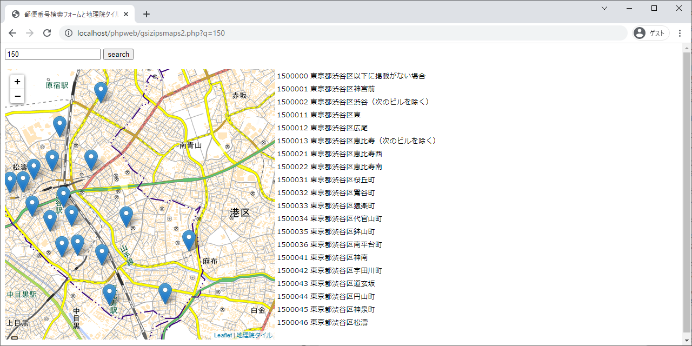

# 9章 ウェブアプリの実例：補足

# 9.1 郵便番号データベース

### 9.1.1 データの準備

**p. 146**

郵便番号データの配布形式がlzhからzipに変わったため、`lha`をインストールする必要は無くなりました。

`unzip`と`curl`をインストールします。

```bash
sudo apt-get -y install unzip curl
```

郵便番号データ（zipファイル）をダウンロードします。（作業はホームディレクトリで行うと仮定しています。）

```bash
cd
curl -O http://www.post.japanpost.jp/zipcode/dl/oogaki/zip/ken_all.zip
curl -O http://www.post.japanpost.jp/zipcode/dl/jigyosyo/zip/jigyosyo.zip
```

ダウンロードしたファイルを展開します。

```bash
unzip ken_all.zip
unzip jigyosyo.zip
```

### 9.1.2 データのインポート

**p. 146** 「The used command is not allowed with this MySQL version.」というエラーが出たときは、一度コンソールに戻って、`mysql -uroot -ppass --local-infile`として再接続してからインポートしてください。

郵便番号データはShift_JISのCSVファイルなので，インポート前に`SET character_set_database=cp932;`として文字コードを設定します。

Ubuntuのコンソールで次のコマンドを実行してインポートすることもできます。

```bash
curl https://raw.githubusercontent.com/taroyabuki/webbook2/master/src/09/zips.sql | mysql -uroot -ppass --local-infile mydb
```

## 9.2 GETによる検索

### 9.2.1 JSPでの実装

**p. 148** 郵便番号を送信していない時に空のtable要素が生成されるのが気になる時は以下のようにコードを修正してください。

* [zips.jsp](zips.jsp)

### 9.2.1 PHPでの実装

**p. 149** 郵便番号を送信していない時に空のtable要素が生成されるのが気になる時は以下のようにコードを修正してください。

* [zips.php](zips.php)

### 9.2.3 GETによる検索の動作確認と改良

* [http://localhost:8080/javaweb/zips.jsp?q=150](http://localhost:8080/javaweb/zips.jsp?q=150)
* [http://localhost/phpweb/zips.php?q=150](http://localhost/phpweb/zips.php?q=150)

**p. 150** 環境によってはzips.jspやzips.phpの結果が文字化けしますが、この段階では気にしなくてかまいません。これは、文字コードを指定がブラウザに送られていないためなのです。9.3節以降では、文字コードを指定しているので文字化けは起こりません。

## 9.4 Google Maps APIとのマッシュアップ，9.5 Ajaxによるリアルタイム検索

Google Maps APIが使いにくくなったため、代わりに~~Yahoo! JavaScriptマップAPI~~地理院タイルを使います。
そのためのサンプルを、https://github.com/taroyabuki/webdevelop で公開しています。（Dockerで環境構築をしていますが、本書の環境でも問題なく動作します．）



### コラム：GlassFishの単体利用

**p. 161** インストーラではなくzip archiveを使ってGlassFishを導入した時は`http://localhost:4848/`にアクセス、左の列の「Enterprise Server」をクリック、「管理者パスワード」をクリックし、適当なパスワードを設定します。

Ubuntuの起動時にGlassFishサーバも起動させたいときは、/etc/rc.localに`/opt/glassfishv3/bin/asadmin start-domain domain1`を追記します。
